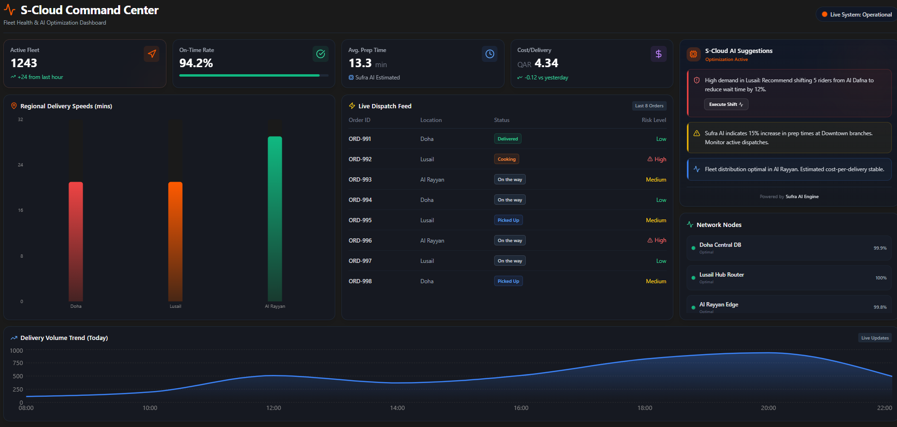

# S-Cloud Fleet Health & AI Optimization Dashboard



## 🌍 Project Overview
**S-Cloud** represents the next evolutionary leap for Snoonu: transitioning from a consumer-centric Super-App into a global **Platform-as-a-Service (PaaS)** infrastructure provider. 

This prototype dashboard demonstrates the power of S-Cloud's infrastructure when licensed to global partners—empowering governments and large-scale retailers to manage their own localized delivery ecosystems with unprecedented efficiency. By leveraging predictive analytics and real-time telemetry, S-Cloud directly addresses critical operational bottlenecks (such as sub-optimal rider-restaurant matching), driving a targeted increase in overall delivery efficiency by ~15%.

## ✨ Key Features
* **Real-time Telemetry:** Uninterrupted, live tracking of fleet health across all operational regions, delivering instantaneous situational awareness.
* **AI Optimizer Panel:** Predictive, dynamic shifting of rider distribution based on localized demand heatmaps to proactively prevent service degradation.
* **KPI Analytics:** Instant visibility into mission-critical metrics including "Estimated Cost-per-Delivery" and "On-Time Delivery Rate."
* **Reactive Dispatching:** Advanced algorithmic visualization designed to systematically minimize "Rider Idle Time" and heavily penalize "Long-distance Assignment."

## 🛠️ Tech Stack


## ⚙️ Architecture & AI Logic
While this prototype utilizes simulated localized data, it accurately mirrors the architecture of a production-grade, event-driven microservices environment. 

In a real-world scenario, the telemetry pipeline would ingest thousands of geographic coordinate events per second via an Azure/Kubernetes hosted event stream. The **Sufra AI Engine** (simulated here via reactive state fluctuation intervals) represents a dedicated machine learning inference microservice. It analyzes historical delivery volumes against active dispatch states to continuously output optimized rider-reallocation vectors, ensuring fleet saturation perfectly matches predictive demand curves.

## 🚀 Quick Start
To spin up this enterprise dashboard locally:

1. **Install Dependencies:**
   ```bash
   npm install
   ```
2. **Start the Development Server:**
   ```bash
   npm run dev
   ```
3. **Access the Dashboard:**
   Open `http://localhost:5173` in your browser.

## 💡 Author & Intent
This Proof-of-Work (PoW) was engineered to demonstrate a deep understanding of logistics PaaS requirements and scalable frontend architecture. It is built by a developer profoundly passionate about scaling the GCC's technology ecosystem and exporting MENA-born innovation to the global market.
